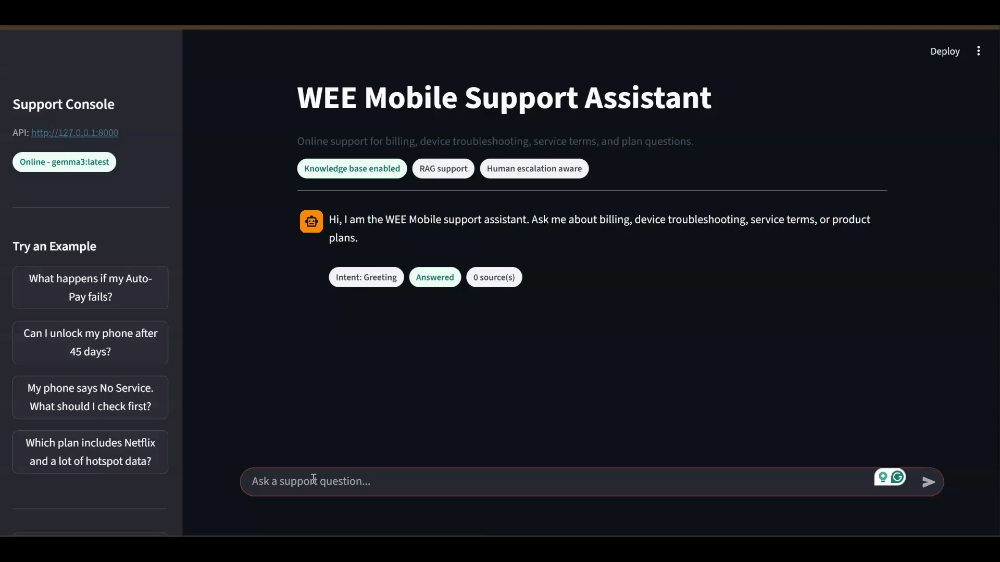

# Enterprise AI Support Agent (RAG-Based)

An enterprise-style customer support assistant for fictional WEE Mobile support
documents. The agent classifies a user question, retrieves relevant knowledge
base chunks with FAISS, and asks a configured LLM provider to produce a grounded
answer.

The project is intentionally compact, but includes core pieces for an AI support prototype: configurable model providers, retrieval, source
attribution, escalation behavior, a FastAPI backend, a Streamlit chat UI,
evaluation utilities, and Docker support.

## Features

- Intent classification for Billing, Technical Support, Products, Service Terms,
  Greeting, and Escalate.
- Rule-based classifier fallback so demos remain usable if the classifier LLM is
  temporarily unavailable.
- Retrieval-augmented generation using cleaned support documents, normalized
  sentence-transformer embeddings, and FAISS.
- Configurable LLM provider: Ollama, OpenAI, or Gemini.
- Simple `/query` endpoint for the Streamlit app and direct API demos.
- OpenAI-compatible `/v1/chat/completions` endpoint for Open WebUI and similar
  clients.
- `/health` and `/health/llm` endpoints for runtime diagnostics.
- Streamlit chat UI with session history, example prompts, metadata, and source
  display.
- Evaluation script for intent accuracy and retrieval source hit rate.
- Multi-stage Docker build with separate API and UI dependency sets.

## Architecture

```text
User query
  -> Streamlit, Open WebUI, or API client
  -> FastAPI
  -> Greeting / intent handling
  -> FAISS retrieval
  -> Grounded LLM response
  -> Answer with intent, sources, and escalation status
```

## Project Structure

```text
ai_support_agent/
|-- agent/
|   |-- intent_classifier.py
|   |-- llm_client.py
|   |-- prompts.py
|   |-- retriever.py
|   `-- support_agent.py
|-- api/
|   `-- app.py
|-- data/
|   |-- raw_docs/
|   |-- chunks.json
|   |-- metadata.json
|   |-- support-agent-demo.gif
|   |-- support_index.faiss
|   `-- test_questions.json
|-- eval/
|   `-- evaluate.py
|-- ingest/
|   |-- chunk_docs.py
|   |-- document_loader.py
|   `-- embed_store.py
|-- ui/
|   `-- streamlit_app.py
|-- config.py
|-- .env.example
|-- Dockerfile
|-- docker-compose.yml
|-- requirements.txt
|-- requirements.api.txt
|-- requirements.ui.txt
`-- README.md
```

## Setup

Create and activate a virtual environment:

```bash
python -m venv .venv
.venv\Scripts\activate
```

Install all local development dependencies:

```bash
pip install -r requirements.txt
```

For smaller installs, use:

```bash
pip install -r requirements.api.txt
pip install -r requirements.ui.txt
```

Create local configuration:

```bash
copy .env.example .env
```

## Model Configuration

### Ollama

Install Ollama, then pull the default local model:

```bash
ollama pull gemma3
```

Use this `.env` configuration for local non-Docker runs:

```text
LLM_PROVIDER=ollama
LLM_MODEL=gemma3:latest
OLLAMA_BASE_URL=http://127.0.0.1:11434
```

### OpenAI

```text
LLM_PROVIDER=openai
LLM_MODEL=gpt-4o-mini
OPENAI_API_KEY=your_api_key_here
```

### Gemini

```text
LLM_PROVIDER=gemini
LLM_MODEL=gemini-1.5-flash
GEMINI_API_KEY=your_api_key_here
```

## Data Preparation

The repo includes generated chunks and a FAISS index. Rebuild them whenever raw
documents, chunk settings, or embedding settings change:

```bash
python ingest/chunk_docs.py
python ingest/embed_store.py
```

The ingestion step reads text with encoding fallbacks, cleans common copied-text
artifacts, and stores chunk metadata such as source document and chunk id.

## Run Locally

Start the API:

```bash
uvicorn api.app:app --reload
```

Health checks:

```bash
curl http://127.0.0.1:8000/health
curl http://127.0.0.1:8000/health/llm
```

Simple query:

```bash
curl -X POST http://127.0.0.1:8000/query ^
  -H "Content-Type: application/json" ^
  -d "{\"question\":\"What happens if my Auto-Pay fails?\"}"
```

OpenAI-compatible query:

```bash
curl -X POST http://127.0.0.1:8000/v1/chat/completions ^
  -H "Content-Type: application/json" ^
  -d "{\"model\":\"support-agent\",\"messages\":[{\"role\":\"user\",\"content\":\"Can I unlock my phone after 45 days?\"}]}"
```

Start the Streamlit UI in a second terminal:

```bash
streamlit run ui/streamlit_app.py
```

The UI calls the `/query` endpoint and displays the answer, detected intent,
escalation status, and retrieved source documents.

## Run with Docker

Create `.env` first:

```bash
copy .env.example .env
```

If you are using Ollama on your host machine, make sure the model is available:

```bash
ollama pull gemma3
```

For Docker, `.env` can keep `OLLAMA_BASE_URL=http://127.0.0.1:11434` for local
non-container runs. The compose file overrides the API container with
`DOCKER_OLLAMA_BASE_URL`, which should usually be:

```text
DOCKER_OLLAMA_BASE_URL=http://host.docker.internal:11434
```

Build and run the API and UI:

```bash
docker compose up --build
```

Open:

- API: `http://127.0.0.1:8000`
- Streamlit UI: `http://127.0.0.1:8501`

Useful Docker checks:

```bash
curl http://127.0.0.1:8000/health
curl http://127.0.0.1:8000/health/llm
docker compose logs api
```

If `/health` shows `ollama_base_url` as `http://127.0.0.1:11434` inside Docker,
the API container is pointing at itself instead of host Ollama. Set
`DOCKER_OLLAMA_BASE_URL=http://host.docker.internal:11434` in `.env`, then run:

```bash
docker compose up --build
```

The compose file mounts `./data` into the API container so rebuilt FAISS indexes
and metadata remain available at runtime. The Dockerfile uses separate `api` and
`ui` targets; the API image preinstalls CPU-only Torch to avoid large CUDA-backed
PyTorch wheels.

## Open WebUI

Run Open WebUI with Docker:

```bash
docker run -d ^
  -p 3000:8080 ^
  -e OLLAMA_BASE_URL=http://host.docker.internal:11434 ^
  --name open-webui ^
  ghcr.io/open-webui/open-webui:main
```

Then open `http://localhost:3000` and configure:

- API Base URL: `http://host.docker.internal:8000/v1`
- API Key: any value
- Model: `support-agent`

## Evaluation

Run:

```bash
python eval/evaluate.py
```

The evaluator reports:

- Intent classification accuracy.
- Retrieval top-1 source hit rate.
- Retrieval top-3 source hit rate.
- Unexpected escalations.
- Per-question details.

## Demo



## Notes and Limitations

- The bundled documents are fictional and are intended for demonstration only.
- Retrieval uses a local FAISS index and sentence-transformer embeddings. Re-run
  ingestion when raw documents or embedding settings change.
- Provider API calls are intentionally implemented with the Python standard
  library to keep the project easy to inspect.
- Docker images are still moderately large because local embeddings require
  PyTorch and transformer dependencies. The split API/UI requirements and
  CPU-only Torch install reduce unnecessary UI weight and avoid CUDA wheels in
  the API image.
