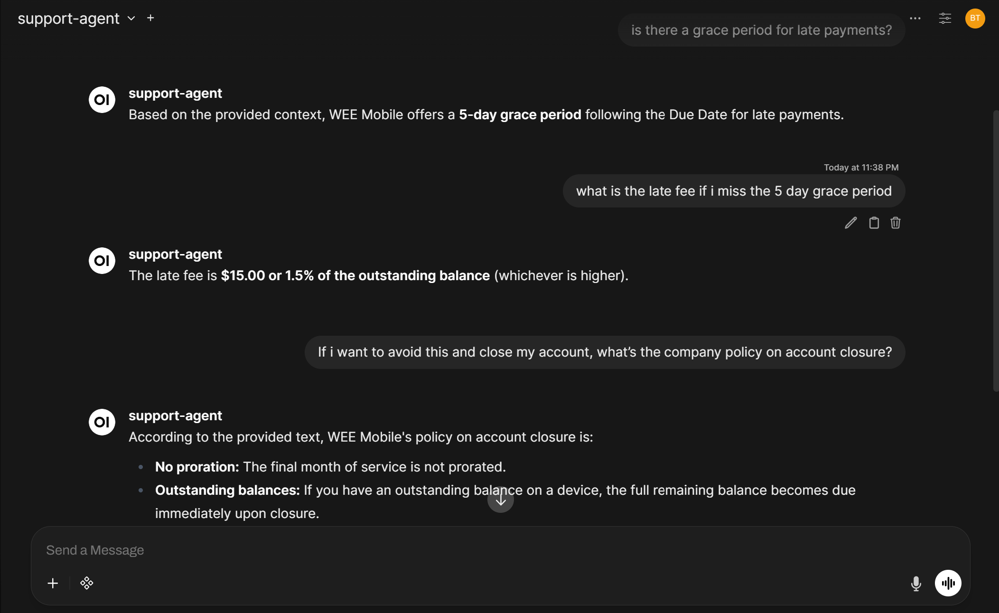

# Enterprise AI Support Agent (RAG-Based)

An enterprise-style customer support assistant for fictional WEE Mobile support
documents. It classifies the user's intent, retrieves relevant policy/product
knowledge from a FAISS vector index, and generates a grounded answer with an
LLM provider of your choice.

The project is intentionally small enough to follow, but includes the pieces a
manager or technical reviewer expects to see in a serious AI support prototype:
configuration, API access, UI access, source attribution, escalation behavior,
and evaluation metrics.

## Features

- LLM-based intent classification for Billing, Technical Support, Products,
  Service Terms, and Escalate.
- Retrieval-augmented generation using sentence-transformer embeddings and
  FAISS.
- Configurable LLM provider: Ollama, OpenAI, or Gemini.
- OpenAI-compatible `/v1/chat/completions` endpoint for Open WebUI and similar
  tools.
- Simple `/query` endpoint for local apps and demos.
- Streamlit UI with answer metadata and retrieved sources.
- Evaluation script for intent accuracy and retrieval source hit rate.

## Architecture

```text
User query
  -> Streamlit, Open WebUI, or API client
  -> FastAPI
  -> Intent classification
  -> FAISS retrieval
  -> Grounded LLM response
  -> Answer with intent, sources, and escalation status
```

## Project Structure

```text
ai_support_agent/
|-- agent/
|   |-- intent_classifier.py
|   |-- llm_client.py
|   |-- prompts.py
|   |-- retriever.py
|   `-- support_agent.py
|-- api/
|   `-- app.py
|-- data/
|   |-- raw_docs/
|   |-- chunks.json
|   |-- metadata.json
|   |-- support_index.faiss
|   `-- test_questions.json
|-- eval/
|   `-- evaluate.py
|-- ingest/
|   |-- chunk_docs.py
|   `-- embed_store.py
|-- ui/
|   `-- streamlit_app.py
|-- config.py
|-- .env.example
|-- requirements.txt
`-- README.md
```

## Setup

Create and activate a virtual environment:

```bash
python -m venv .venv
.venv\Scripts\activate
```

Install dependencies:

```bash
pip install -r requirements.txt
```

Create local configuration:

```bash
copy .env.example .env
```

## Model Configuration

### Option 1: Ollama

Install Ollama, then pull a model:

```bash
ollama pull gemma
```

Use this `.env` configuration:

```text
LLM_PROVIDER=ollama
LLM_MODEL=gemma
OLLAMA_BASE_URL=http://127.0.0.1:11434
```

### Option 2: OpenAI

Use this `.env` configuration:

```text
LLM_PROVIDER=openai
LLM_MODEL=gpt-4o-mini
OPENAI_API_KEY=your_api_key_here
```

### Option 3: Gemini

Use this `.env` configuration:

```text
LLM_PROVIDER=gemini
LLM_MODEL=gemini-1.5-flash
GEMINI_API_KEY=your_api_key_here
```

## Data Preparation

The repo includes generated chunks and a FAISS index, but you can rebuild them:

```bash
python ingest/chunk_docs.py
python ingest/embed_store.py
```

## Run the API

```bash
uvicorn api.app:app --reload
```

Health check:

```bash
curl http://127.0.0.1:8000/health
```

Simple query:

```bash
curl -X POST http://127.0.0.1:8000/query ^
  -H "Content-Type: application/json" ^
  -d "{\"question\":\"What happens if my Auto-Pay fails?\"}"
```

OpenAI-compatible query:

```bash
curl -X POST http://127.0.0.1:8000/v1/chat/completions ^
  -H "Content-Type: application/json" ^
  -d "{\"model\":\"support-agent\",\"messages\":[{\"role\":\"user\",\"content\":\"Can I unlock my phone after 45 days?\"}]}"
```

## Run the Streamlit UI

In a second terminal:

```bash
streamlit run ui/streamlit_app.py
```

The UI calls the `/query` endpoint and displays the answer, detected intent,
and retrieved source documents.

## Open WebUI

Run Open WebUI with Docker:

```bash
docker run -d ^
  -p 3000:8080 ^
  -e OLLAMA_BASE_URL=http://host.docker.internal:11434 ^
  --name open-webui ^
  ghcr.io/open-webui/open-webui:main
```

Then open `http://localhost:3000` and configure:

- API Base URL: `http://host.docker.internal:8000/v1`
- API Key: any value
- Model: `support-agent`

## Evaluation

Run:

```bash
python eval/evaluate.py
```

The evaluator reports:

- Intent classification accuracy.
- Retrieval top-1 source hit rate.
- Retrieval top-3 source hit rate.
- Unexpected escalations.
- Per-question details.

## Example Conversation



## Notes and Limitations

- The bundled documents are fictional and are intended for demonstration only.
- The app does not stream responses yet, even though it accepts OpenAI-style
  request bodies.
- Retrieval uses a local FAISS index and sentence-transformer embeddings. Re-run
  ingestion when raw documents change.
- Provider API calls are intentionally implemented with the Python standard
  library to keep the project easy to inspect.
